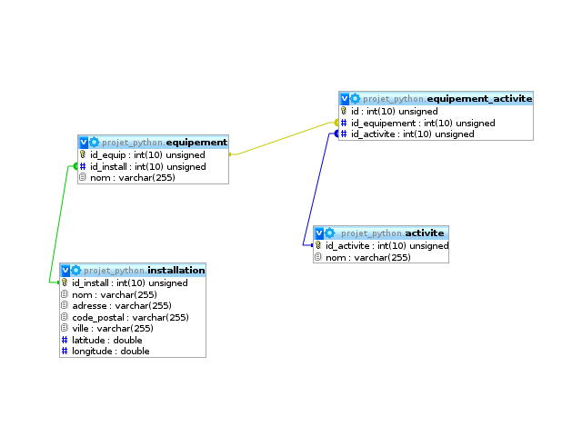

# Installations sportives
Projet de l'IUT de Nantes en Python consistant à mettre en oeuvre un service REST. Le projet se base entièrement sur des données récupérées via des fichiers CSV (http://data.paysdelaloire.fr). Le serveur met à disposition un service de renseignement sur les installations sportives présentent en pays de la loire. 

# Architecture globale

# Schéma de la base de données
